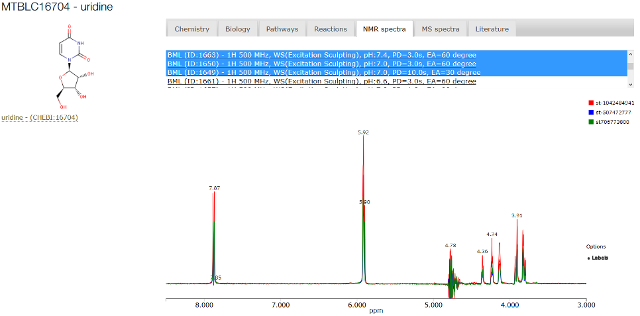
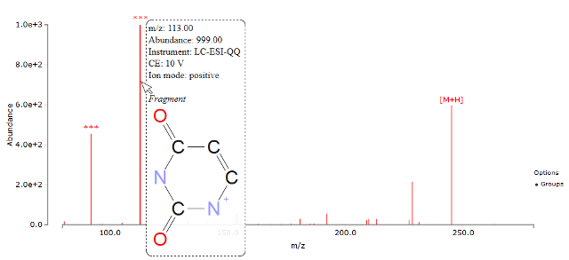

# SpeckTackle
***st.js*** is a JavaScript library to create custom-tailored charts for spectroscopy in life sciences. 
Implemented charts exist for mass spectrometry, one- and two-dimensional NMR, UV/VIS, IR, and general continuous data use cases such as chromatograms.

## Table of Contents
* [Installation](https://bitbucket.org/sbeisken/specktackle/wiki/Installation)
* [Usage](https://bitbucket.org/sbeisken/specktackle/wiki/Usage)

## Example
* [MetaboLights](http://www.ebi.ac.uk/metabolights/MTBLC27570#nmrspectra)

