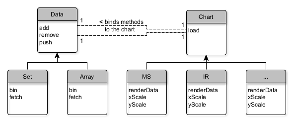

# Install
The latest version of SpeckTackle can downloaded from the [source directory](https://bitbucket.org/sbeisken/specktackle/src) 
of the project. The files **st.min.js** and **css/st.css** are the only files required for installation. Once they are 
referenced in the HTML website, the library can be used like any other JavaScript library.

```
#!html+django

<head>
    <!-- SpeckTackle CSS containing chart stylings -->
    <link rel="stylesheet" type="text/css" href="css/st.css">
    <!-- SpeckTackle library -->
    <script type="text/javascript" src="libs/st/st.js"></script>
<head>
```

## Dependencies
SpeckTackle depends on the D3 (Data Driven Documents) and JQuery JavaScript libraries, which are used in many websites. 
D3 simplifies the manipulation of the DOM (Document Object Model) and provides visualisation components, which form the 
base of the SpeckTackle charting library. JQuery is primarily used for HTML traversal and Ajax handling. 
Both libraries are assumed to be defined globally within the website.

* [jquery](http://jquery.com/)
* [d3](http://d3js.org/)

```
#!html+django

<head>
    <title>SpeckTackle</title>
    <meta charset="UTF-8">
    
    <!-- Main page CSS -->
    <link rel="stylesheet" type="text/css" href="css/index.css">
    <!-- SpeckTackle CSS containing chart stylings -->
    <link rel="stylesheet" type="text/css" href="css/st.css">
    
    <!-- SpeckTackle library -->
    <script type="text/javascript" src="libs/st/st.js"></script>
    <!-- SpeckTackle dependencies -->
    <script type="text/javascript" src="libs/d3/d3.js"></script>
    <script type="text/javascript" src="libs/jquery/jquery.js"></script>
</head>
```

# Develop
The library can be cloned from its public Git repository.

```
$ git clone git clone https://sbeisken@bitbucket.org/sbeisken/specktackle.git
```

The following subsections explain how to build and extend the chart base type of the library.

## Make
SpeckTackle uses a simple make script to build two files: the library **st.js** and its minified version
**st.min.js**. The PREFIX variable need to be adjusted to the absolute path of the project directory 
before running the script.

```
$ make clean all
```

## Dependencies
The make script requires the 'smash' and 'uglify-js' libraries. Both libraries can be installed
via [node.js](http://nodejs.org/).

```
$ npm install -g smash
$ npm install -g uglify-js
```

## Extensions
The files **st.js** and **index.js** under the 'SpeckTackle/js' source directory are required
for 'smash' to identify and combine all files of the library. Whenever a file is added to the project,
the corresponding index needs to be updated. The visualisation of the charts is handled by D3 and a 
working knowledge of JavaScript and D3 is assumed.

To add a new chart type to SpeckTackle, it is best to extend **chart.js**. The file is extended simply
by defining the functions outlined below and assigning them to the base chart object. Additional changes
can be achieved by overriding existing functions of the base chart object as demonstrated in the NMR chart.
An minimal working example of an extension can be found in the MS chart.

```
#!js+cheetah

st.chart.myChart = function () {
    var myChart = chart(); // create and extend base chart
    
    /**
     * Rescales the x domain.
     */
    myChart.xscale = function () {
        // TODO
    };
    
    /**
     * Rescales the y domain.
     */
    myChart.yscale = function () {
        // TODO
    };
    
    /**
     * Insertion point for custom behavior.
     */
    myChart.behavior = function () {
        // TODO
    };
    
    /**
     * Renders the data: defines how data points are drawn onto the canvas.
     *
     * @returns {object} the binned data set for the current x-axis scale
     */
    myChart.renderdata = function () {
        // get the binned data set for the current x-axis scale
        var data = this.data.bin(this.width, this.scales.x);

        // TODO

        return data;
    };
    
    return myChart;
};
```

The two default data structures currently supported are 'sets' and 'arrays'. Default data handlers
simplify data load and process data for visualisation, e.g. bins the data or assigns annotations to
individual data points. Data needs to be in JSON format and can be provided either via URLs pointing
to a data source or directly as array. Loading of data is delegated by the **data.js** base object to
its respective extensions. Data handlers define the functions listed below. Unless data cannot be formatted
to the supported JSON structures outlined on the 
[Usage](https://bitbucket.org/sbeisken/specktackle/wiki/Usage#Data) website, there is no need to implement
an additional data structure.

```
#!js+cheetah

st.data.myDataStructure = function () {
    // base data structure to be extended
    var myDataStructure = data();
    
    /**
     * Sets the optional x data accessor.
     *
     * @param {string} x A x data accessor
     * @returns {object} the data object
     */
    myDataStructure.x = function (x) {
        if (x && typeof x === 'string') {
            this.opts.x = x;
        } else {
            console.log('Invalid x accessor option.');
        }
        return this;
    };
    
    /**
     * Gets the unbinned data array for the current chart.
     *
     * @param {number} width The chart width
     * @param {function} xscale The d3 x axis scale
     * @returns {object[]} the unbinned data array
     */
    myDataStructure.get = function (width, xscale) {
        // global data container for all series
        var rawbinned = [];
        
        // TODO
        
        return rawbinned;
    };
    
    /**
     * Gets the binned data array for the current chart.
     *
     * @param {number} width The chart width
     * @param {function} xscale The d3 x axis scale
     * @param {boolean} invert Whether to bin using min instead of max
     * @returns {object[]} the binned data array
     */
    myDataStructure.bin = function (width, xscale, invert) {
        // global data container for all series
        var rawbinned = [];
        
        // TODO
        
        return rawbinned;
    };
    
    /**
     * Function parsing the input data (and annotations).
     *
     * @param {string[]} json The raw data series
     * @param {string[]} json2 The raw annotation data
     * @param {object} set The target data set
     */
    myDataStructure.seriesfetch = function (json, json2) {
        // TODO
    };
    
    return myDataStructure;
};
```

In case input data cannot be directly provided in JSON format, parsers can be used in an
intermediate stop before data load. These parsers would take the data handler in its callback function
and execute data load after input data has been parsed.

```
#!js+cheetah

chart.load(array);
st.parser.jdx("resources/ir.jdx", function (jdx) {
    array.add(jdx);
});
```

The following diagram shows the relationships between the data and chart structures and their 
extensions. The data object serves as data handle for all data-related interactions.


